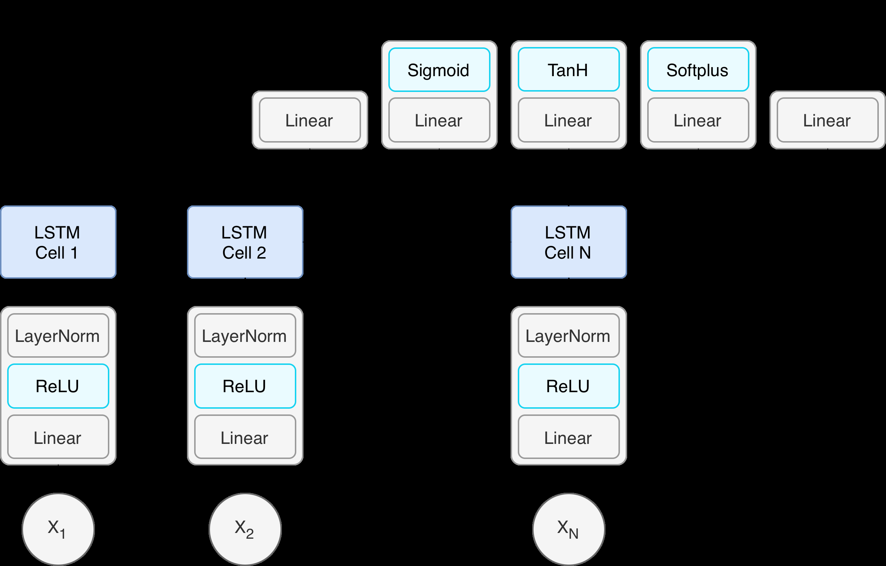
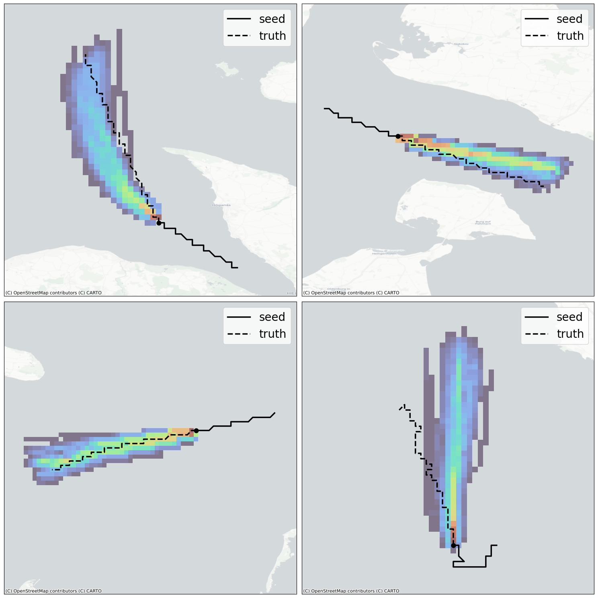

# Computationally efficient recurrent architectures for discretized trajectory prediction in resource-constrained settings

> Daniil Losev, Antonio Riverso, Andrea Sanvito — 02456 Deep Learning, DTU Compute, Fall 2025

The full report is available [here](docs/report.pdf).

## Abstract

Trajectory prediction models are often based on large architectures and high-resolution spatial representations, making them unsuitable for embedded or resource-constrained systems. This work proposes an efficient, fully parametric sequence-to-one forecasting model designed to adapt to a wide range of computational budgets and operational needs.

The model structure, window size, prediction horizon, hidden dimension, number of LSTM layers, grid resolution and even the number of Monte Carlo rollouts can all be tuned based on available resources. Despite operating with minimal configurations, such as a single LSTM layer with as few as 32 or 64 hidden units, the model maintains strong predictive performance.

These results show that carefully designed lightweight architectures can provide reliable trajectory forecasting while remaining deployable in embedded or high-efficiency settings, such as drones or smart gadgets.

## Architecture

The pipeline consists of three macro-stages:

- **data wrangling**: one week of [AIS data](http://aisdata.ais.dk/) from Danish waters is sanitized, restricted to a geographical region, and filtered to keep only meaningful segments.
- **discretization**: the task is ported from regression over raw coordinates to classification over a grid.
- **modeling**: each input sample is a 10-dimensional feature vector predicted through two heads, a **classification** head over the 3×3 grid of possible next moves, and a **regression** head for the remaining attributes.

The model has been tested against a non-parametric baseline that averages recent timesteps (lower bound) and a larger sequence-to-sequence model (upper bound).

The architecture of the sequence-to-one model is reported in the figure below.

  

## Results

The model was evaluated under different configurations, considering window-size, layers dimension, and depth. Results are reported in percentage for accuracy and in cells for mean error.

| Model | Dimension | Layers | Window | Accuracy |
|---|---:|---:|---:|---:|
| baseline | - | - | 20 | 37.00% |
| seq2one | 32 | 1 | 20 | 80.82% |
| seq2one | 32 | 4 | 20 | 80.42% |
| seq2one | 64 | 1 | 20 | 81.60% |
| seq2one | 64 | 2 | 20 | 81.65% |
| seq2one | 128 | 1 | 20 | 82.99% |
| seq2one | 128 | 2 | 20 | 82.73% |
| seq2one | 256 | 1 | 20 | 82.24% |
| seq2one | 128 | 1 | 100 | 84.88% |
| seq2seq | 128 | 1 | 20 | 84.07% |

Over longer horizons the trained models perform better than the baseline, keeping a 20-step (approximately 20 km) prediction within around 4 km of the true position.

| Step | Baseline Acc | Baseline Mean | Seq2One Acc | Seq2One Mean | Seq2Seq Acc | Seq2Seq Mean |
|---:|---:|---:|---:|---:|---:|---:|
| 1 | 37.15 | 0.70 | 73.30 | 0.35 | 78.27 | 0.28 |
| 5 | 36.63 | 2.94 | 62.18 | 1.18 | 63.44 | 1.14 |
| 10 | 35.74 | 5.83 | 56.43 | 2.14 | 57.95 | 2.11 |
| 20 | 34.25 | 11.84 | 52.51 | 4.55 | 53.84 | 4.11 |
| 40 | 31.64 | 25.26 | 48.82 | 11.49 | 48.23 | 9.21 |

### Monte Carlo simulation

Generative capabilities and robustness of the model were evaluated through Monte Carlo simulations.

Each rollout proceeds autoregressively over a 40-step horizon (around 2 hours of travel): the model samples the movement from its predicted grid distribution at the previous step and updates the vessel's physical attributes through the regression heads.

  

The rollouts highlight many learned behaviors, including sharp turns and staying far from the coastline.

## Usage

The repository is organized as a set of notebooks:

- [`code/helpers/raw_to_parquet.ipynb`](code/helpers/raw_to_parquet.ipynb): downloads and converts raw AIS data to Parquet format.
- [`code/seq2one.ipynb`](code/seq2one.ipynb): data wrangling, discretization, baseline and sequence-to-one model, accuracy evaluation, and the Monte Carlo simulation.
- [`code/seq2seq.ipynb`](code/seq2seq.ipynb): the bidirectional sequence-to-sequence upper-bound model.
